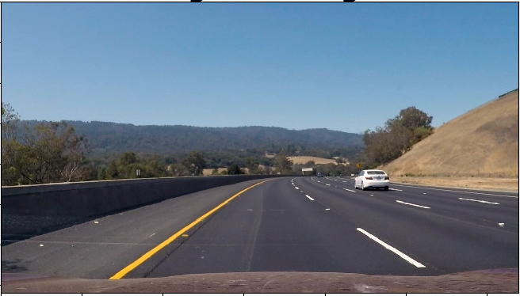
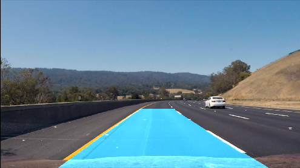

## Lane-Detection

Using OpenCV to perform Lane Detection from a Video feed

This method uses perspective transforms, a sobel filter, and the sliding window algorithim to find the lane lines.

Below is the pipeline that was used

Original image:

Bird's eye perspective transform, and sobel filter in grayscale

Histogram of Warped image. This represents the number of white pixels in column `x`

Sliding Window Algorithim and poly line fitting

Inverse Warp and Overlayed:

Sobel Filtering and Sliding Window Algorithim result:

