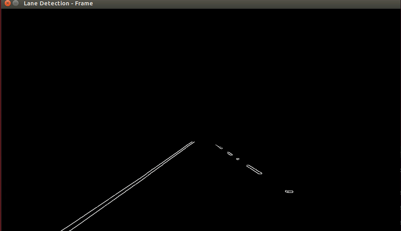

## Lane-Detection

Using OpenCV to perform Lane Detection from a Video feed

This method uses the Canny Edge Detection and Hough Line Transforms

Below is the pipeline that was used

Original:

GreyScaled:

After performing Canny Edge Detection:

After finding edges only in the area of interest

Final Result after using Hough Transform:

