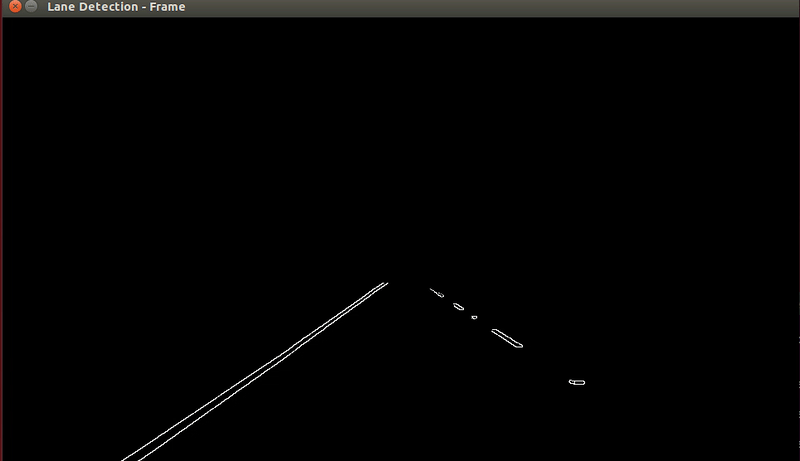
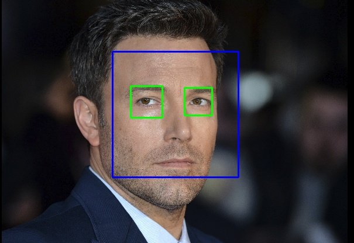

# OpenCV-Projects
This repo holds a collection of projects that I have completed using OpenCV, for the purpose of learning how to use OpenCV.

## Lane-Detection
Using OpenCV to perform Lane Detection from a Video feed

Original:

GreyScaled:

After performing Canny Edge Detection:

After finding edges only in the area of interest

Final Result after using Hugh Transform:

## Kalman-Filter
Using OpenCV's kalman filter to track an object over time.

## Face-Detection

Using OpenCV's Haarcascades to recognize eyes and faces.

## Test_OpenCV_Cpp
- some files to test whether my C++ install of OpenCV is working

