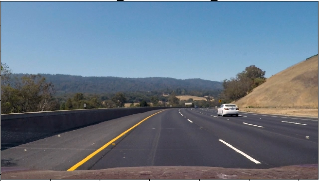
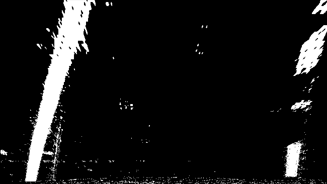
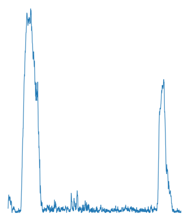
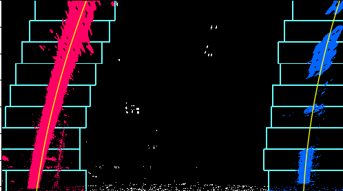

# OpenCV-Projects

This repo holds a collection of programs that I have completed using OpenCV, for the purpose of learning how to use OpenCV and other things about computer vision in general.

## Lane-Detection

Using OpenCV to perform Lane Detection from a Video feed

Original image:

Bird's eye perspective transform, and sobel filter in grayscale

Histogram of Warped image:

Sliding Window Algorithim and poly line fitting

Inverse Warp and Overlayed:

Sobel Filtering and Sliding Window Algorithim result:

## Kalman-Filter

Using OpenCV's kalman filter to track an object over time.

## Face-Detection

Using OpenCV's Haarcascades to recognize eyes and faces.

## Test_OpenCV_Cpp

- some files to test whether my C++ install of OpenCV is working
